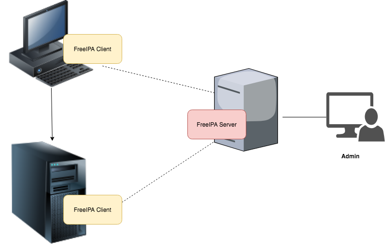
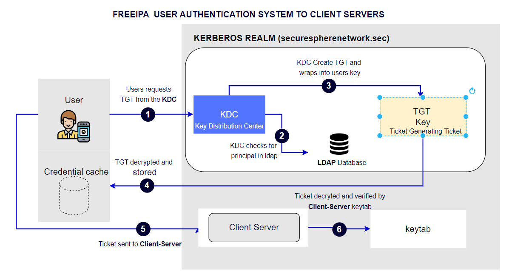

# <center> Installation and configuration of FREEIPA on CENTOS/8 machine

 
### 
<div align="center">
 
</div>

## Step by step guide

## Section 1
### FreeIPA Server Installation and Configuration
 1. Provision FreeIPA Server and two other Client machine to VirtualBox using Vagrant infrastructure as code.
 2. Login To FreeIPA server terminal mode and install and configure it. 


## Section 2
### FreeIPA Client installation and connection
 1. Install and configure client machine with FreeIPA client
 2. Connect the two client machine to FreeIPA server

## Section 3
### FreeIPA User Administration and management
 1. Create Users in FreeIPA server,
 2. Create Group in FreeIPA server
 3. Asign Users to Group.
 4. Login to any of the client machine using user login details.


## Section 4
### Multi-Factor Authentication for Secure Login
1. Using Token
2. Using SSH-Key  


## Installating the FREEIPA server

Installing FREEIPA on centos/8 server

```bash
  hostnamectl 

hostnamectl set-hostname freeipa.securespherenetwork.sec

timedatectl list-timezones

timedatectl status

timedatectl set-timezone Africa/Lagos


dnf module enable idm:DL1

dnf install ipa-server ipa-server-dns -y

ipa-server-install --setup-dns


firewall-cmd --permanent --add-service=ntp
firewall-cmd --permanent --add-service=http
firewall-cmd --permanent --add-service=https
firewall-cmd --permanent --add-service=ldap
firewall-cmd --permanent --add-service=ldaps
firewall-cmd --permanent --add-service=kerberos
firewall-cmd --permanent --add-service=kpasswd
firewall-cmd --reload
```


## Installating the FREEIPA Client

```bash
hostnamectl 

hostnamectl set-hostname client1.securespherenetwork.sec

timedatectl list-timezones

timedatectl status

timedatectl set-timezone Africa/Lagos

yum -y install freeipa-client ipa-admintools

ipa-client-install --hostname=`hostname -f` --mkhomedir --server=freeipa.securespherenetwork.sec  --domain securespherenetwork.sec --realm SECURESPHERENETWORK.SEC
```

#
#
#

# <center> KERBEROS AUTHENTICATION SYSTEM IN FREEIPA </center>
### 
<div align="center">
 
</div>